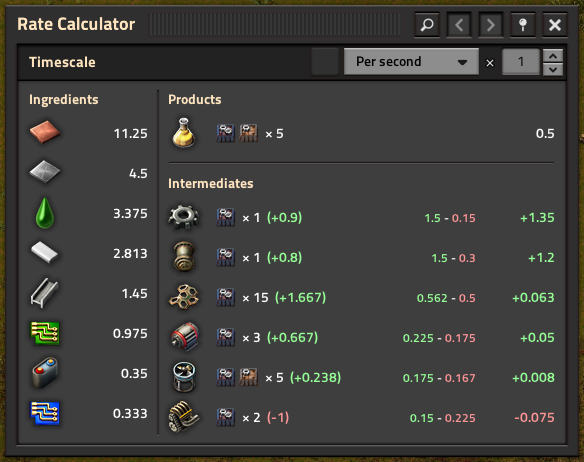
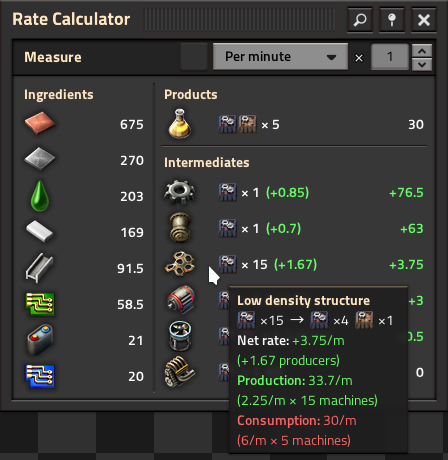

# ⚠️ This project has migrated to [Codeberg](https://codeberg.org/raiguard/RateCalculator).

# Rate Calculator

Calculate maximum production and consumption rates for the selected machines.

## Installation

[Download on the Mod Portal.](https://mods.factorio.com/mod/RateCalculator)

## Usage

Select some machines with the selection tool (found on the shortcut bar, or use
the hotkey `Alt + X`) to calculate the maximum production and consumption rates
for those machines. The rates will be displayed in the GUI:

The GUI shows rates in several categories:

- **Ingredients:** Materials that the machines import.
- **Products:** Materials that the machines export.
- **Intermediates:** Materials that some machines produce and others consume.
The displayed rate is the "net rate" of that intermediate material.

With a given set, your goal is to make all of the intermediate net rates
positive (green) or neutral (white). The numbers in parenthesis next to the
machine counts denote "net producers" i.e. how many fewer or more
similarly-configured machines you need to build to produce the material at the
required rate.

The above screenshot shows that this yellow science set needs at least 1
more assembler producing engine units to achieve the required input rates. It
also shows that there is an extra assembler making low density structures that
can safely be removed from the set.

Use the dropdown to change the timescale for the measurements. Select a
container or cargo wagon with the entity selector to scale the measurements to
that container or wagon's capacity (accounting for stack sizes). Select a
transport belt or inserter to measure against that belt or inserter's maximum
item transfer rate.

Use the manual multiplier input and/or buttons to scale the entire subfactory's
rates and machine counts by that multiplier.

You can access the previous ten sets by using the navigation buttons in the
titlebar.

## Tips and tricks

- Selecting normally will produce a new selection. Alternatively, you can also
hold **shift** to append the existing selection, or use **shift + right click**
to remove machines from the selection.
- Press the shortcut / use the hotkey again when already holding the tool to
show the GUI.
- Power input rates are not shown by default, but can be enabled in the mod
settings.
- Hovering over an entry will give more detailed information about that rate:

